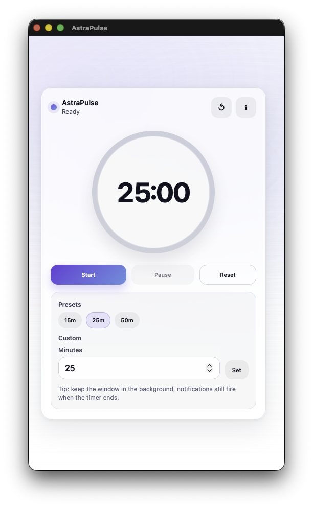

<p align="center">
  
</p>

<h1 align="center">AstraPulse</h1>

<div align="center">
  
  [](https://github.com/sandbox-science/AstraPulse/releases/tag/v1.0.0)
  [](https://github.com/sandbox-science/AstraPulse/releases/tag/v1.0.0)
  [](LICENSE)
  [](https://tauri.app)
  [](#)

</div>

A minimalist, desktop-first timer app designed for simplicity and ease of use. You can start a timer and forget about the app; it won’t forget you. When the timer reaches zero, the app will emit a background sound to alert you that the time is up. You can focus on your work instead of constantly checking when your next break is.

## Features

- Minimal, distraction-free interface
- Background notification sound when time expires
- Preset and custom timer durations
- Designed for long-running desktop usage
- Built with Tauri and Svelte

> [!NOTE]
> 
> AstraPulse has been fully tested on macOS, but not yet on Windows and Linux.


## Download

### macOS

- Download the macOS `.dmg` installer from the latest [release](https://github.com/sandbox-science/AstraPulse/releases).

### Windows & Linux

- Windows and Linux builds are not yet available as prebuilt downloads.
- Support for additional platforms is planned for a future release.

#### Notes

- AstraPulse can be built from source on all platforms using the instructions below.
- The macOS build is packaged and signed using Tauri’s standard tooling.

### Run for development

```bash
# Build the frontend
cd frontend
npm run dev
# Open a new terminal window in the root directory and run:
cargo tauri dev
```

### Build for production

```bash
# Build the frontend
cd frontend
npm install
# Open a new terminal window in the root directory and run:
cargo tauri build
```

## Notes

- The frontend is implemented with Svelte and lives in `frontend/`.
- The backend is implemented with Rust and Tauri, and lives in `src-tauri/`.

## Demo


